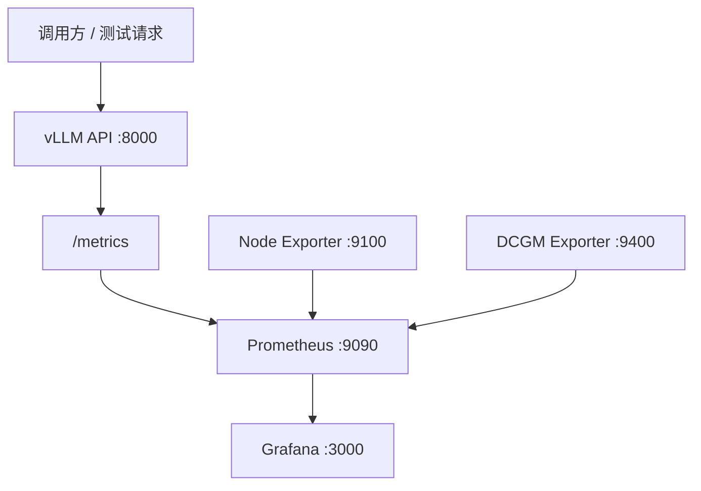

# ModelOps Sentinel

> 大模型部署、接口测试与 Prometheus/Grafana 可观测性实践

ModelOps Sentinel 是一份面向大模型服务运维与测试场景的实践项目文档。项目以 vLLM 部署 OpenAI 兼容接口为核心，把模型准备、服务启动、接口验证、主机与 GPU 指标采集、Prometheus 存储以及 Grafana 展示串成一条完整链路。

本仓库根据实际部署与监控笔记整理，并在公开前完成脱敏和结构化改写。所有地址、密钥和机器配置均为示例，不包含公司源码、真实凭据或内网信息。

## 项目目标

- 使用 vLLM 启动 OpenAI 兼容的大模型推理服务。
- 通过 HTTP 请求验证模型是否能够正常返回内容。
- 通过 vLLM 的 `/metrics` 端点采集服务指标。
- 使用 Node Exporter 采集宿主机 CPU、内存、磁盘和网络指标。
- 使用 NVIDIA DCGM Exporter 采集 GPU 利用率、显存和温度等指标。
- 使用 Prometheus 统一抓取和保存指标。
- 使用 Grafana 建立大模型服务监控面板。
- 建立从部署到监控的验收清单和故障排查方法。

## 技术栈

| 分类 | 技术 |
| --- | --- |
| 模型服务 | vLLM、OpenAI Compatible API |
| 模型来源 | ModelScope 或其他可信模型仓库 |
| 运行环境 | Python venv、Linux、NVIDIA Driver |
| 容器平台 | Docker、Docker Compose、NVIDIA Container Toolkit |
| 指标采集 | vLLM Metrics、Node Exporter、DCGM Exporter |
| 监控存储 | Prometheus |
| 可视化 | Grafana |
| 验证方式 | curl、服务日志、PromQL |

## 总体架构



数据链路可以分为两部分：

1. **业务链路**：调用方通过 `/v1/chat/completions` 请求 vLLM，vLLM 加载模型并返回推理结果。
2. **监控链路**：Prometheus 定时抓取 vLLM、Node Exporter 和 DCGM Exporter 的指标，Grafana 查询 Prometheus 并展示仪表盘。

## 一、部署前准备

### 1. 硬件与系统检查

大模型部署前应根据模型版本、权重精度、上下文长度和并行策略评估 GPU 数量与显存。不要只依据模型名称估算资源，应以模型卡、vLLM 兼容性说明和实际压测结果为准。

建议先执行：

```bash
nvidia-smi
docker --version
docker compose version
python3 --version
```

确认以下条件：

- NVIDIA 驱动工作正常。
- 多张 GPU 均可被系统识别。
- Docker 和 Docker Compose 可用。
- 容器部署时已安装 NVIDIA Container Toolkit。
- 模型目录所在磁盘具有足够空间。
- 服务器端口未被其他进程占用。

### 2. 创建 Python 虚拟环境

本项目使用 venv，不依赖 Conda：

```bash
python3 -m venv .venv
source .venv/bin/activate

python -m pip install --upgrade pip
python -m pip install vllm modelscope
```

> vLLM、CUDA、PyTorch 和驱动版本之间存在兼容关系。生产环境应固定版本，不建议长期使用未锁定版本的依赖。

### 3. 下载模型

可以在 ModelScope 查找模型，并使用命令行下载：

```bash
modelscope download \
  --model <组织名/模型名> \
  --local_dir <本地模型目录>
```

下载后至少检查：

```bash
du -sh <本地模型目录>
find <本地模型目录> -maxdepth 2 -type f | head
```

重点确认：

- 配置文件和 tokenizer 文件存在。
- 权重分片数量完整。
- 文件大小与模型仓库说明大致一致。
- 下载过程没有中断或磁盘写满。

## 二、启动 vLLM 模型服务

以下命令以 MiniMax-M2.5 类型的模型为案例。解析器名称和并行参数具有模型、硬件和 vLLM 版本相关性，使用前应通过 `vllm serve --help` 和对应模型说明确认。

```bash
export MODEL_PATH="<本地模型目录>"
export VLLM_API_KEY="<通过安全方式注入的密钥>"

SAFETENSORS_FAST_GPU=1 nohup vllm serve "$MODEL_PATH" \
  --host 0.0.0.0 \
  --port 8000 \
  --served-model-name MiniMax-M2.5 \
  --trust-remote-code \
  --enable-expert-parallel \
  --tensor-parallel-size 8 \
  --api-key "$VLLM_API_KEY" \
  --enable-auto-tool-choice \
  --tool-call-parser minimax_m2 \
  --reasoning-parser minimax_m2_append_think \
  > /var/log/vllm/model-start.log 2>&1 &
```

参数职责：

| 参数 | 作用 | 使用注意 |
| --- | --- | --- |
| `--host 0.0.0.0` | 监听所有网卡 | 需要配合防火墙、鉴权或反向代理 |
| `--port 8000` | 指定 API 与 metrics 端口 | 端口应避免与其他服务冲突 |
| `--served-model-name` | 设置 API 请求中的模型名称 | 必须与测试请求中的 `model` 一致 |
| `--trust-remote-code` | 允许执行模型仓库自定义代码 | 只对可信模型来源启用 |
| `--tensor-parallel-size 8` | 将模型切分到 8 张 GPU | 数量应匹配可见 GPU 和模型需求 |
| `--enable-expert-parallel` | 启用 MoE 专家并行 | 仅在模型与版本支持时使用 |
| `--api-key` | 开启接口鉴权 | 不要把真实密钥写入仓库 |
| `--tool-call-parser` | 解析模型工具调用输出 | 解析器需要与模型匹配 |
| `--reasoning-parser` | 解析模型推理内容 | 不同模型可能使用不同解析器 |

### 启动日志检查

```bash
tail -f /var/log/vllm/model-start.log
```

只有满足以下条件，才能认为服务启动成功：

- 模型权重加载完成。
- 未出现 CUDA OOM 或权重分片缺失。
- HTTP 服务已经监听目标端口。
- 健康检查返回成功。
- 至少完成一次真实推理请求。

## 三、接口测试

### 1. 健康检查

```bash
curl -fsS http://127.0.0.1:8000/health
```

### 2. OpenAI 兼容接口测试

```bash
curl --fail-with-body http://127.0.0.1:8000/v1/chat/completions \
  -H "Content-Type: application/json" \
  -H "Authorization: Bearer ${VLLM_API_KEY}" \
  -d '{
    "model": "MiniMax-M2.5",
    "messages": [
      {
        "role": "user",
        "content": "请用一句话说明 Prometheus 的作用。"
      }
    ],
    "max_tokens": 100,
    "temperature": 0.2
  }'
```

测试时不要只检查 HTTP 状态码，还应检查：

- `choices` 是否存在。
- `choices[0].message.content` 是否非空。
- 返回的模型名称是否符合预期。
- `usage` 中是否包含 token 使用量。
- 请求耗时是否处于可接受范围。
- 日志中是否出现异常、重试或显存错误。

### 3. Metrics 端点测试

vLLM 的 OpenAI 兼容服务会暴露 Prometheus 格式指标：

```bash
curl -fsS http://127.0.0.1:8000/metrics | head
```

指标名称可能随 vLLM 版本变化。建立 Grafana 面板前，应先查看当前服务实际暴露的指标，不要直接照搬其他版本的 PromQL。

## 四、监控组件职责

| 组件 | 输入 | 输出 | 主要职责 |
| --- | --- | --- | --- |
| vLLM Metrics | 推理请求与引擎状态 | Prometheus 指标 | 请求量、token、时延、队列与 KV Cache |
| Node Exporter | Linux 宿主机信息 | `:9100/metrics` | CPU、内存、磁盘和网络 |
| DCGM Exporter | NVIDIA DCGM 遥测 | `:9400/metrics` | GPU 利用率、显存、功耗和温度 |
| Prometheus | Exporter 与 vLLM 指标 | 时序数据与 PromQL | 定时抓取、保存和查询指标 |
| Grafana | Prometheus 查询结果 | Dashboard | 可视化、筛选和告警展示 |

## 五、Prometheus 抓取配置

`prometheus.yml` 示例：

```yaml
global:
  scrape_interval: 15s
  evaluation_interval: 15s

scrape_configs:
  - job_name: prometheus
    static_configs:
      - targets:
          - prometheus:9090

  - job_name: vllm
    metrics_path: /metrics
    static_configs:
      - targets:
          - host.docker.internal:8000

  - job_name: node-exporter
    static_configs:
      - targets:
          - node-exporter:9100

  - job_name: dcgm-exporter
    static_configs:
      - targets:
          - dcgm-exporter:9400
```

当 Prometheus 运行在 Docker 中、vLLM 运行在宿主机时，需要为 Prometheus 容器配置：

```yaml
extra_hosts:
  - "host.docker.internal:host-gateway"
```

如果 vLLM 也运行在同一 Compose 网络中，应直接使用服务名，例如 `vllm:8000`，避免依赖固定容器 IP。

### 配置校验

```bash
docker compose config
docker compose up -d
docker compose ps
```

Prometheus 启动后，在浏览器访问：

```text
http://<服务器地址>:9090/targets
```

所有目标均显示 `UP`，才说明指标链路已经连通。

## 六、Grafana 配置

Grafana 与 Prometheus 位于同一个 Docker 网络时，Prometheus 数据源地址应填写：

```text
http://prometheus:9090
```

推荐流程：

1. 打开 Grafana：`http://<服务器地址>:3000`。
2. 进入 **Connections → Data sources**。
3. 添加 Prometheus 数据源。
4. 将 URL 设置为 `http://prometheus:9090`。
5. 点击 **Save & test**。
6. 导入或创建大模型监控 Dashboard。

生产环境不要使用 `admin/admin` 等默认凭据。管理员密码应通过 Docker Secret、环境管理系统或其他安全方式注入。

## 七、Dashboard 设计

原始实践材料中包含一份 10 面板的 Grafana Dashboard。整理后建议按四个层次设计：

### 1. 流量

- 每秒成功请求数（QPS/RPS）。
- 输入 token/s。
- 输出 token/s。
- 请求成功率与失败率。

### 2. 延迟

- 首 token 延迟（TTFT）。
- 每 token 时间（TPOT）。
- 端到端请求耗时。
- P50、P95、P99 延迟。

### 3. 调度与缓存

- 正在运行的请求数。
- 等待队列长度。
- KV Cache 使用率。
- 请求抢占或重计算情况。

### 4. 资源

- 单卡 GPU 利用率。
- GPU 显存使用量。
- GPU 温度与功耗。
- 宿主机 CPU、内存、磁盘和网络。

示例 PromQL 只能作为起点：

```promql
sum(rate(vllm:request_success_total[1m]))
```

```promql
sum(rate(vllm:generation_tokens_total[1m]))
```

```promql
avg(vllm:kv_cache_usage_perc)
```

> 如果查询没有数据，先在 vLLM 的 `/metrics` 输出中搜索对应名称。不同版本可能重命名、弃用或移除指标。

## 八、验收清单

### 模型服务

- [ ] 模型文件完整，磁盘空间充足。
- [ ] vLLM 日志显示权重加载成功。
- [ ] `/health` 返回成功。
- [ ] `/v1/chat/completions` 返回非空内容。
- [ ] API 模型名称与 `--served-model-name` 一致。
- [ ] 真实密钥没有写入代码仓库。

### 监控链路

- [ ] vLLM `/metrics` 可以访问。
- [ ] Node Exporter `:9100/metrics` 可以访问。
- [ ] DCGM Exporter `:9400/metrics` 可以访问。
- [ ] Prometheus Targets 全部为 `UP`。
- [ ] Grafana 数据源测试成功。
- [ ] Dashboard 能显示请求、token、延迟和 GPU 指标。
- [ ] Prometheus 和 Grafana 数据卷能够持久化。

### 安全与运维

- [ ] 仅开放业务必需端口。
- [ ] API 已启用鉴权。
- [ ] Grafana 默认密码已修改。
- [ ] `--trust-remote-code` 仅用于可信模型。
- [ ] 服务日志已配置轮转。
- [ ] 容器镜像和 Python 依赖已固定版本。

## 九、常见问题与排查

### 1. HTTP 成功但回答为空

按以下顺序检查：

1. 查看 vLLM 服务日志。
2. 确认模型权重和 tokenizer 下载完整。
3. 确认请求中的 `model` 与服务名称一致。
4. 检查工具调用解析器和推理解析器是否适配当前模型。
5. 对比物理机与 Docker 环境中的 vLLM、CUDA 和 PyTorch 版本。
6. 使用最小请求关闭工具调用等可选功能，再逐项恢复参数。

### 2. CUDA OOM

- 检查模型实际显存需求。
- 降低最大上下文长度或并发量。
- 调整 tensor parallel / expert parallel 策略。
- 检查是否有其他进程占用 GPU。
- 结合 GPU 指标与服务日志判断 OOM 发生阶段。

### 3. 外部无法访问服务

- 检查 vLLM 是否监听 `0.0.0.0`。
- 检查安全组和防火墙是否允许目标端口。
- 检查反向代理与路由配置。
- 先从服务器本机测试，再从同网段和外部逐层测试。
- 不应为了排障直接关闭全部防火墙规则。

### 4. Prometheus Target 为 DOWN

- 在 Prometheus 容器内解析目标服务名。
- 检查端口、`metrics_path` 和 Docker 网络。
- 检查 Exporter 容器日志。
- 确认宿主机服务可通过 `host.docker.internal` 到达。
- 避免依赖容易变化的容器 IP。

### 5. Grafana 面板显示 No data

- 在 Prometheus 查询页面直接执行 PromQL。
- 检查数据源 UID 是否与 Dashboard 定义一致。
- 查看当前 vLLM 版本的实际指标名称。
- 调整 Dashboard 时间范围和刷新周期。
- 确认请求流量已经产生，而不是只有空闲指标。

## 十、AI 协作方式

本项目采用“人负责目标、环境与验证，AI 负责结构化分析与辅助生成”的协作方式：

- 我负责提供真实部署材料、明确目标、执行命令、观察日志并验证结果。
- AI 协助梳理各组件的职责、输入输出和调用链。
- AI 将零散命令整理为部署、测试、监控和排障流程。
- 对 AI 给出的命令和结论，使用真实服务、HTTP 响应、Prometheus Targets 和 Grafana 数据进行验证。
- 发现版本差异或环境差异时，以官方文档和实际运行结果为准。

这种方式避免把 AI 输出直接当作事实，同时保留了 AI 在资料整理、代码解释和问题定位方面的效率优势。

## 项目边界

- 本仓库是公开、脱敏的工程实践文档，不包含生产源码和真实基础设施配置。
- 示例以单机 Linux + 多 GPU + Docker Compose 为主要场景。
- 模型、GPU 数量、端口、镜像标签和指标名称需要根据实际环境调整。
- 文档不承诺示例参数适用于所有模型或所有 vLLM 版本。

## 参考资料

- [vLLM OpenAI-Compatible Server](https://docs.vllm.ai/en/stable/serving/online_serving/)
- [vLLM Metrics](https://docs.vllm.ai/en/stable/design/metrics/)
- [Prometheus Configuration](https://prometheus.io/docs/prometheus/latest/configuration/configuration/)
- [Grafana Prometheus Data Source](https://grafana.com/docs/grafana/latest/datasources/prometheus/configure/)
- [Grafana Provisioning](https://grafana.com/docs/grafana/latest/administration/provisioning/)
- [NVIDIA DCGM Exporter](https://docs.nvidia.com/datacenter/dcgm/latest/installation/install-dcgm-exporter.html)
- [ModelScope Models](https://www.modelscope.cn/models)

## License and usage

本项目用于个人学习、技术交流和作品展示。实际生产部署前，请结合组织安全规范、模型许可协议和软硬件版本重新验证全部配置。
