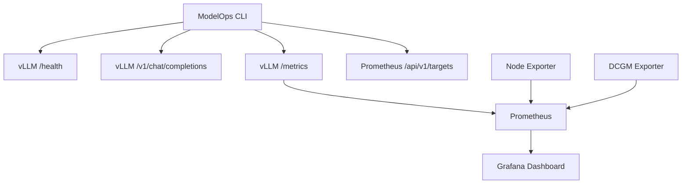
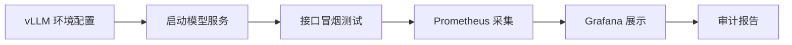

# ModelOps Sentinel

> 一个可运行的大模型服务部署验证与可观测性审计项目

ModelOps Sentinel 面向 vLLM 的 OpenAI 兼容服务，将模型启动、接口测试、服务审计和可观测性整合为一个项目，提供三部分能力：

1. 参数化 vLLM 启动脚本，用于从脱敏环境配置启动本地模型服务。
2. 一个零第三方运行时依赖的 Python CLI，用于检查 vLLM 健康、对话返回、Prometheus Metrics 和抓取目标。
3. 一套 Docker Compose 监控栈，包含 Prometheus、Grafana、Node Exporter，以及可选的 NVIDIA DCGM Exporter。

项目来源于真实模型部署、接口测试与监控实践材料，公开内容已移除内网地址、真实密钥和生产配置。

## 能解决什么问题

- 服务端口通了，但模型是否真的能回答？
- HTTP 200 是否包含有效的 `choices[0].message.content`？
- vLLM 的 `/metrics` 是否暴露了可抓取指标？
- Prometheus 中是否存在 DOWN 状态的目标？
- Grafana、Prometheus、主机指标和 GPU 指标如何组成完整链路？
- 如何生成一份可留档的 JSON 或 Markdown 验收报告？

## 架构



## 端到端链路



对应操作顺序：

1. 复制并修改 `config/vllm.env.example`。
2. 通过 `scripts/start_vllm.sh` 启动模型。
3. 通过 `scripts/smoke_test.sh` 验证健康、推理和指标。
4. 通过 `deploy/compose.yaml` 启动监控栈。
5. 在 Grafana 查看自动加载的 Dashboard。
6. 使用 CLI 输出 JSON 或 Markdown 验收报告。

## 项目结构

```text
modelops-sentinel/
├── src/modelops_sentinel/
│   ├── auditor.py              # 健康、推理、指标和 Targets 检查
│   └── cli.py                  # 命令行参数、输出与退出码
├── tests/test_auditor.py       # 网络响应模拟和核心逻辑测试
├── scripts/
│   ├── start_vllm.sh           # 参数化启动 vLLM
│   └── smoke_test.sh           # 一键执行服务冒烟测试
├── config/vllm.env.example     # 模型启动与审计配置模板
├── deploy/
│   ├── compose.yaml            # Prometheus/Grafana/Exporter 监控栈
│   ├── prometheus/             # 普通版与 GPU 版抓取配置
│   └── grafana/                # 数据源、Dashboard 自动加载配置
├── docs/deployment-guide.md    # vLLM 部署、测试与排障说明
├── pyproject.toml              # Python 包和 CLI 入口
├── .github/workflows/ci.yml    # Python 3.10/3.12 自动测试
├── Makefile                    # 常用命令
└── .env.example                # 审计工具环境变量示例
```

## 快速开始

### 1. 创建 venv 并安装

```bash
git clone https://github.com/y2312209763-glitch/modelops-sentinel.git
cd modelops-sentinel

python3 -m venv .venv
source .venv/bin/activate
python -m pip install -e .
```

也可以执行：

```bash
make install
```

### 2. 运行自动化测试

```bash
make test
```

测试不需要 GPU、Docker 或真实 vLLM 服务，使用模拟 HTTP 响应验证：

- 完整成功链路。
- 模型返回空内容。
- Prometheus 存在 DOWN 目标。
- Markdown 报告生成。

每次提交和 Pull Request 也会通过 GitHub Actions 自动执行这些检查，并验证 Python、Shell、JSON 和 YAML 文件。

## 启动模型服务

先准备模型文件和与 CUDA 环境兼容的 vLLM，再复制配置模板：

```bash
cp config/vllm.env.example config/vllm.env
```

至少修改：

- `MODEL_PATH`
- `SERVED_MODEL_NAME`
- `VLLM_API_KEY`
- `TENSOR_PARALLEL_SIZE`
- 模型需要的 tool/reasoning parser

启动服务：

```bash
set -a
source config/vllm.env
set +a
./scripts/start_vllm.sh
```

也可以使用 `make start-vllm`。脚本默认以前台进程运行，便于交给 systemd、Supervisor 或容器平台管理。

### 3. 审计一个正在运行的服务

```bash
export VLLM_BASE_URL=http://127.0.0.1:8000
export VLLM_MODEL=MiniMax-M2.5
export VLLM_API_KEY=replace-me
export PROMETHEUS_URL=http://127.0.0.1:9090

modelops-sentinel
```

如果已经配置了 `config/vllm.env`，可以直接执行：

```bash
make smoke
```

示例输出：

```text
CHECK               STATUS  LATENCY  DETAIL
vLLM health         PASS    4.2 ms   HTTP 200
vLLM metrics        PASS    8.7 ms   HTTP 200; 42 unique metric names
chat completion     PASS    913 ms   HTTP 200; non-empty answer (2 chars)
Prometheus targets  PASS    6.1 ms   3 up, 0 down
```

如果没有传入 `--model`，推理检查会显示 `SKIPPED`，其余检查仍会执行。

## 生成验收报告

JSON：

```bash
modelops-sentinel --format json --output audit-report.json
```

Markdown：

```bash
modelops-sentinel --format markdown --output audit-report.md
```

只要存在失败项，进程退出码就是 `1`，因此可以接入 Shell 脚本或 CI。

## CLI 参数

| 参数 | 环境变量 | 含义 |
| --- | --- | --- |
| `--vllm-url` | `VLLM_BASE_URL` | vLLM 服务根地址 |
| `--model` | `VLLM_MODEL` | 对话测试使用的模型名称 |
| `--api-key` | `VLLM_API_KEY` | Bearer API Key |
| `--prometheus-url` | `PROMETHEUS_URL` | Prometheus 根地址 |
| `--prompt` | - | 对话测试内容 |
| `--timeout` | - | 单次 HTTP 超时秒数 |
| `--format` | - | `table`、`json` 或 `markdown` |
| `--output` | - | 将报告保存到文件 |

查看完整帮助：

```bash
modelops-sentinel --help
```

## 启动监控栈

### CPU/主机监控模式

```bash
cd deploy
cp .env.example .env

# 必须先修改 Grafana 密码
docker compose up -d
```

访问地址：

- Prometheus：`http://127.0.0.1:9090`
- Prometheus Targets：`http://127.0.0.1:9090/targets`
- Grafana：`http://127.0.0.1:3000`

Grafana 会自动加载：

- 名为 `Prometheus` 的默认数据源。
- `ModelOps Sentinel / vLLM service overview` Dashboard。

### GPU 监控模式

GPU 模式要求 Linux、NVIDIA 驱动、Docker 和 NVIDIA Container Toolkit：

```bash
cd deploy
PROMETHEUS_CONFIG_FILE=./prometheus/prometheus-gpu.yml \
  docker compose --profile gpu up -d
```

GPU 模式会额外启动 DCGM Exporter，并让 Prometheus 抓取 `dcgm-exporter:9400`。

## vLLM 连接方式

默认配置假设：

- vLLM 运行在宿主机 `8000` 端口。
- Prometheus 运行在 Docker 中。
- Prometheus 通过 `host.docker.internal:8000/metrics` 抓取 vLLM。

如果 vLLM 也在同一个 Compose 网络中，应把 Prometheus target 改为对应的 Docker 服务名，例如 `vllm:8000`。

## Dashboard 指标

内置 Dashboard 展示：

- 成功请求 QPS。
- 输出 token/s。
- KV Cache 使用率。
- 等待请求数。
- DCGM GPU 利用率。
- 宿主机内存使用量。

vLLM 的指标名称可能随版本变化。如果面板显示 `No data`，先检查：

```bash
curl -fsS http://127.0.0.1:8000/metrics | less
```

然后依据实际暴露的指标更新 Dashboard PromQL。

## 设计原则

- **不把端口可访问等同于服务可用**：CLI 会检查回答是否非空。
- **不把 HTTP 200 等同于链路健康**：同时检查 Prometheus Targets。
- **不提交秘密**：真实 API Key 和 Grafana 密码只通过运行环境注入。
- **不依赖固定容器 IP**：监控组件使用 Docker 服务名通信。
- **不声称跨版本通用**：模型解析器、镜像和指标名称必须按环境验证。

## 进一步阅读

- [模型部署、接口测试与监控指南](docs/deployment-guide.md)
- [vLLM OpenAI-Compatible Server](https://docs.vllm.ai/en/stable/serving/online_serving/)
- [vLLM Metrics](https://docs.vllm.ai/en/stable/design/metrics/)
- [Prometheus Configuration](https://prometheus.io/docs/prometheus/latest/configuration/configuration/)
- [Grafana Prometheus Data Source](https://grafana.com/docs/grafana/latest/datasources/prometheus/configure/)
- [NVIDIA DCGM Exporter](https://docs.nvidia.com/datacenter/dcgm/latest/installation/install-dcgm-exporter.html)

## AI 协作说明

本项目采用“人负责目标、环境与验证，AI 负责结构化分析与辅助实现”的方式完成：

- 人提供真实部署与监控材料，决定功能范围并验证运行结果。
- AI 协助梳理服务链路、编写可测试代码、生成配置和补充安全检查。
- 所有 AI 生成的结论均应通过测试、接口响应、日志和官方文档再次验证。

## License

[MIT](LICENSE)
